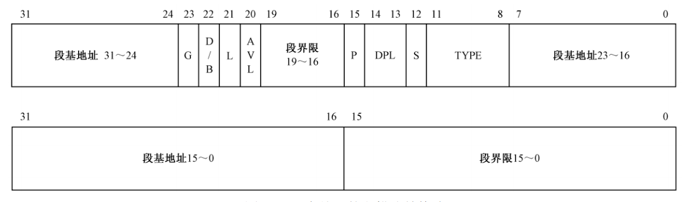
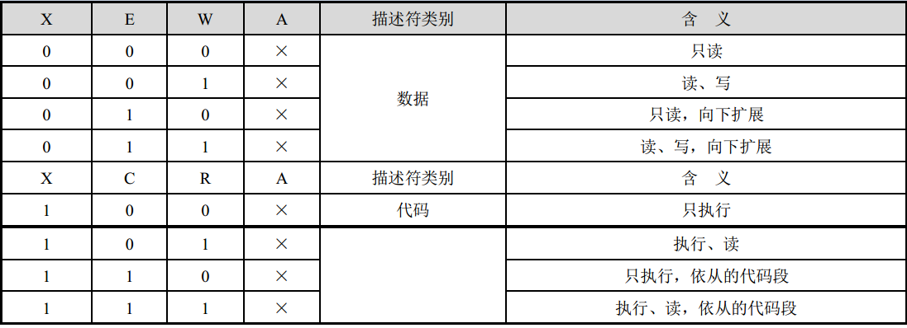

# 实模式和保护模式

### 实模式

* 8086CPU

数据总线：16位

控制总线：16位

地址总线：20位，通过CS和IP两个寄存器拼接出20位的地址，CS << 4 + IP（段基地址 + 偏移），CS + IP称为逻辑地址

* 什么时候运行实模式

在加电和CPU复位时使用实模式，此时不能访问20位以上的地址总线，寻址能力只有1M

* 实模式缺点

1. 段大小受限制：16位offset决定段最大只能位64K（这其实不是实模式的缺点，即使是保护模式，如果offset是16位，依然有这个问题，后来offset变为32位才解决了问题）
2. 不保证地址隔离：段之间可以互相访问，比如数据段可以访问到代码段
3. 程序运行时的地址不确定：

### 保护模式

保护模式定义段基地址、地址范围、和特权级，这样的数据结构成为描述符。判断地址是否在允许范围内，判断当前程序是否有权访问

* 逻辑地址和物理地址

逻辑地址：面向程序的地址，总是从0开始编址，每一条指令的逻辑地址就是与第一条指令之间的相对偏移，因此逻辑地址也叫相对地址

物理地址：内存单元看到的实际地址，也称为绝对地址

* 地址转换时机

1. 编译时
2. 加载时
3. 运行时

* 保护模式的索引过程

1. 寄存器中（CS + IP）存储段选择子（Segment Selector），段选择子为16位
2. 从GDT表中寻找段选择子中的索引，找到段描述符
3. 从段描述符中取出段基地址，使用段基地址 + 偏移量得到线性地址
4. 如果未开启分页，则线性地址为物理地址，可以被送上地址总线
5. 如果开启分页，则将线性地址分为三段，根据顶级页表、二级页表、页内偏移量在多级页表中查找页基地址，页基地址 + 页偏移量得到物理地址，将地址送上地址总线

* 段选择子结构

            --------------------------------------------------
段选择子结构：｜ 13位索引号 | TI 1位 标示GDT/LDT | RPL 2位 标示特权级 ｜
            --------------------------------------------------
Index：在GDT数组或LDT数组中的索引号
TI：值为0表示查找GDT，为1表示查找LDT
RPL：请求特权级，以什么权限访问段

* 段描述符结构

下面是低32位，上面是高32位

G：粒度位，用于解释段界限的含义。
为0时，段界限以 字节 为单位。此时，段的扩展范围是从 1B 到 1MB，因为描述符中的界限值是 20 位的
为1时，段界限以 4KB 为单位。此时，段的扩展范围是从 4KB 到 4GB

D/B：是“默认的操作数大小”（ Default Operation Size）或者“默认的堆栈指针大小”，又或者“上部边界”标志
设立该标志位，主要是为了能够在 32 位处理器上兼容运行 16 位保护模式的程序
D为0 表示指令中的偏移地址或者操作数是 16 位的； D为1，指示 32 位的偏移地址或者操作数
举个例子：
如果代码段描述符的 D 位是 0，那么，当处理器在这个段上执行时，将使用 16位的指令指针寄存器 IP 来取指令，否则使用 32 位的 EIP
对于堆栈段来说，该位被叫做“ B”位，用于在进行隐式的堆栈操作时，是使用 SP 寄存器还是ESP 寄存器

L：是 64 位代码段标志，保留此位给 64 位处理器使用。目前，我们将此位置0即可

AVL：该位是用户位，可以被用户自由使用

P：是段存在位（Segment Present），用于指示描述符所对应的段是否存在
当内存空间紧张时，有可能只是建立了描述符，对应的内存空间并不存在，这时，就应当把P位清零，表示段并不存在
P位是由处理器负责检查的，每当通过描述符访问内存中的段时，如果P位是0，处理器就会产生一个异常中断

DPL：表示描述符的特权级（ Descriptor Privilege Level，DPL），用于指定段的特权级
共有4种处理器支持的特权级别，分别是0、1、2、3，其中0是最高特权级别，3是最低特权级别
刚进入保护模式时执行的代码具有最高特权级 0（可以看成是从处理器那里继承来的），这些代码通常都是操作系统代码，因此它的特权级别最高
每当操作系统加载一个用户程序时，它通常都会指定一个稍低的特权级，比如 3 特权级。
不同特权级别的程序是互相隔离的，其互访是严格限制的，而且有些处理器指令（特权指令）只能由 0 特权级的程序来执行，为的就是安全。这里再次点明了为何叫保护模式

S：位用于指定描述符的类型（ Descriptor Type）
为0时，表示是一个系统段，为1时，表示是一个代码段或者数据段（堆栈段也是特殊的数据段）

TYPE：用于指示描述符的子类型，或者说是类别

对于数据段来说，这 4 位分别是 X、 E、 W、 A 位；而对于代码段来说，这 4 位则分别是 X、 C、 R、 A 位

X：表示是否可以执行
数据段总是不可执行的，X＝0；代码段总是可以执行的，X＝1

E：指示段的扩展方向
0是向上扩展的，也就是向高地址方向扩展的，是普通的数据段；1是向下扩展的，也就是向低地址方向扩展的，通常是堆栈段
　　
W：段是否可写
0是不允许写入，强制写入会引发CPU异常中断；1可以正常写入

A：已访问位
用于指示它所指向的段最近是否被访问过。在描述符创建的时候，应该为0。之后，每当该段被访问时，处理器自动将该位置1

C：代码段是否为特权级依从的
0表示非依从的代码段，这样的代码段可以从与它特权级相同的代码段调用，或者通过门调用；1表示允许从低特权级的程序转移到该段执行
　　 
R：代码段是否允许读出，代码段总是可以执行的，不能写入，至于是否有读出的可能，由R位指定
0不可读，读一个不可读的代码段，会引发处理器异常中断；1代码段可读，即可以把这个段的内容当成ROM一样使用

⚠️如果代码段是不可读的，那处理器怎么从里面取指令执行呢
事实上，这里的R位并非用来限制处理器，而是用来限制程序和指令的行为

### 特权级

* CPL（Current Privilege Level）

存储在CS和SS的第0位和第1位，表示当前代码所在段特权级

当程序转移到不同特权级代码段时，处理器改变CPL，只有0和3，表示内核态和用户态

* DPL（Descriptor Privilege Level）

存储在段描述符中

* RPL（Request Privilege Level）

存储在段选择子中

RPL作用：对于特权级比较高的进程，为了防止其访问到不想访问的数据段，减小进程的特权级

* CPL、RPL、DPL访问关系

max(CPL, RPL) <= DPL
