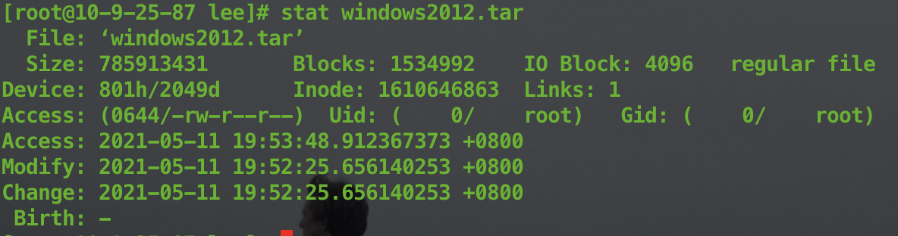
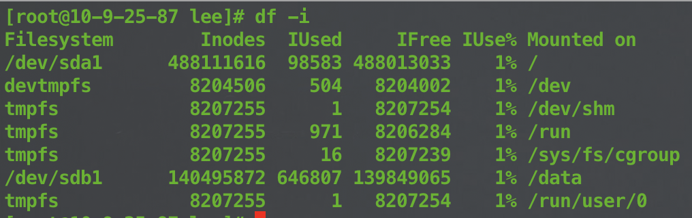

# 文件系统


### inode初始化

文件系统初始化后会分成两个区域：inode区域和数据区域

inode区域包含：inode位图（存储inode使用情况）、block位图（存储block使用情况）、inode表（inode数组，每个大小128KB/256KB）

 -----------------------------------------------------------
| 引导块 ｜ 超级快 ｜ inode位图 ｜ block位图 ｜ inode数组 ｜ 数据区 ｜
 -----------------------------------------------------------

* 寻址过程

从dict找到对应的inode index，在inode的数组里找到inode
在inode中根据要访问的位置和每个块的大小取商，计算出所在块的索引，在inode中进行索引


### 文件索引节点：inode（index node）

* inode structure

 ---------------------
｜     metadata       |
 ---------------------
|                     |
|  12 Direct Pointers |
|                     |   
 ---------------------
|     Indirect        |
 ---------------------
|   x2 Indirect       |
 ---------------------
|   x3 Indirect       |
 ---------------------

* inode metadata（元数据）

File Type：文件类型
Size：文件字节数
Uid：文件所属用户id
Gid：文件所属组id
Access：文件读、写、执行权限
Time：
    Change Time：inode上一次变动时间
    Modify Time：文件内容上一变动时间
    Access Time：文件上一次打开时间
Links：链接数，指有多少文件名指向这个inode
Inode：文件inode number
Blocks：文件块数
IO Blocks：每块大小
Device：


* 查看inode信息

```bash
stat $file
```



* 查看inode使用情况

```bash
df -h
```




### 目录索引节点

每个目录保存文件名和inode索引的映射关系

文件的文件名和inode索引映射保存在父目录里

/ 根目录的的inode索引为2


### 软连接和硬连接

* original file（原来的文件）

一个文件就是map到一个inode上

* symbolic link（软连接）

软连接的内容是被链接文件的name

file2 -> file1 -> inode -> data block

* hard link（硬链接）

硬链接同样是map到inode上，和原文件除了name没有任何区别

file1  
       \
         -> inode -> data block
       / 
file2 

⚠️：  
1. 目录不能被硬链接
2. 硬链接不能跨文件系统

```bash
# 查看具有相同inode的文件
find / -inum $inode_number
```


### 各种操作对inode影响

* 复制文件

创建新的name和inode

* 移动文件

1. 跨文件系统移动，和复制文件相同，并且原inode被删除
2. 同一文件系统，只有directory mapping变，inode不变，实际存储数据不变

* 删除文件

1. 如果link count大于1，删除directory mapping，link count减1
2. 如果link count等于1，inode从inode table里删除，inode number释放，将文件占用的数据块添加到空闲数据块列表


### inode优点

1. 对于无法删除的文件通过删除inode来删除
2. 对于移动获取重命名文件，只改变了directory mapping
3. 删除文件，只释放inode number，不需要删除磁盘数据，下次覆盖即可
4. 打开文件后，只需要通过inode来识别文件
